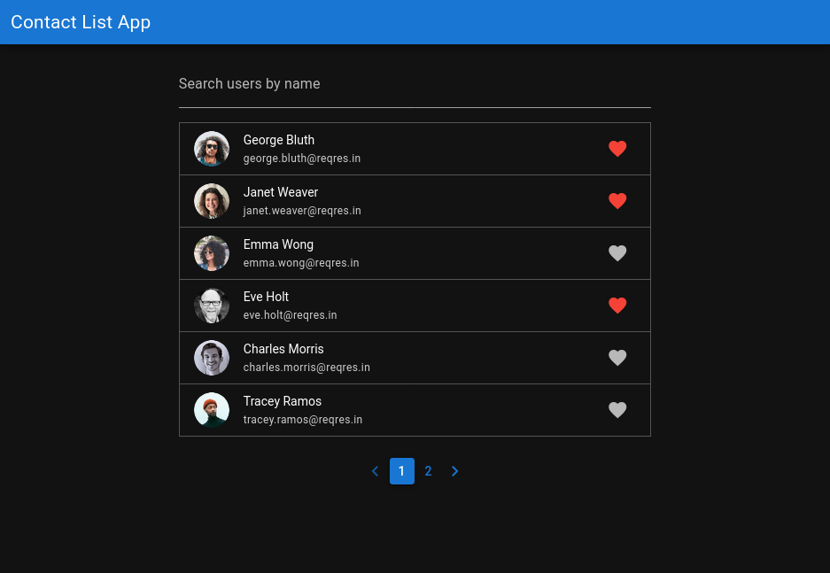

# vContactListApp (v-contact-list)

Demo application that displays a list of contacts from an external rest api.

Link to application:
[https://v-contact-list.netlify.app](https://v-contact-list.netlify.app/)

[](https://app.netlify.com/sites/v-contact-list/deploys)



## Install the dependencies
```bash
npm install
```

### Start the app in development mode (hot-code reloading, error reporting, etc.)
```bash
npm run dev
```

### Lint the files
```bash
npm run lint
```

### Format the files
```bash
npm run format
```

### Build the app for production
```
npm run build
```

## Version
Latest: 0.1.0-dev
